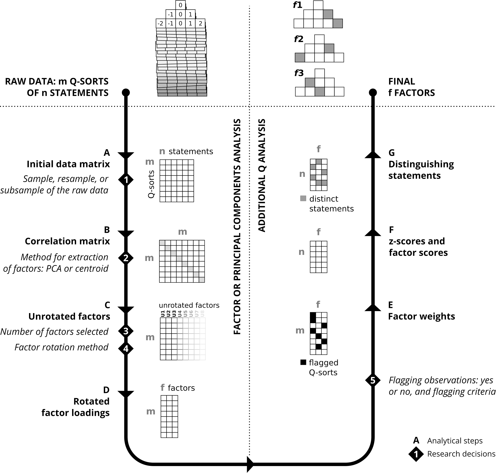

# 1. Q 방법론

* qmethod 매뉴얼1: chrome-extension://efaidnbmnnnibpcajpcglclefindmkaj/https://cran.r-project.org/web/packages/qmethod/qmethod.pdf

* qmethod 매뉴얼2: chrome-extension://efaidnbmnnnibpcajpcglclefindmkaj/https://journal.r-project.org/archive/2014-2/zabala.pdf


* 참고사이트1: http://aiorazabala.github.io/qmethod/Cookbook

* 참고사이트2: chrome-extension://efaidnbmnnnibpcajpcglclefindmkaj/http://contents.kocw.or.kr/KOCW/document/2014/Pusan/kangmunsuk/9.pdf


## 1.1. Q 방법론이란?

* William Stephenson 에 의해 고안된 성격(인성)측정  방법

* 사람의 개인적 관점, 의견과 같은 주관(subjectivity) 연구에 유용한 방법

* 피조사자들이 특정한 대상이나 현상에 대해 가지고 있는 생각이나 태도, 가치관 등의 유사성에 따라서 요인분 석에 의해 집단으로 분류하는 방식

* 사람들이 페미니스트, 포르노, 레즈비언 등을 어떻게 생각하는지 등의 연구에도 사용되어 왔음 


## 1.2. Q 방법론 연구절차

* 연구대상자나 관찰자에게 많은 종류의 진술문이나 그림 등을 줌

* 연구자가 제시한 평정척도 상에 대상자 자신의 기호나 판단을 가장 많이 긍정, 가장 적게 긍정 단계에 따라 분류함

* 제시된 자료에 대해 연구대상자, 관찰자가 생각과 일치하는 정도에 따라 순위를 매기게 하는 방법


## 1.3. Q 방법론 사용목적

* 1. 사람간의 상관 또는 사람 간의 요인탐색: 사람간의 유사성과 유형 규명

* 2. 측정척도의개발 및 타당화

* 3. 체계적인 프로그램 효과 검증

## 1.4. Q 방법론의 방법

* 1. Q 기법 유형: 진술문,그림, 간단한 구나 단어 등 카드에 기록

* 2. 카드 개수 60-90개: 통계적 안정성, 신뢰도 적당

* 3. 평정의 단계: 보통 11단계 사용


## 1.5. 장점

* 1. 특정 주제에 대한 인식의 범위가 제한되지 않음 

* 2. 특정한 교육 방식이나 특수 프로그램의 결과로 야기된 태도 변화나 지각변화를 연구하는데 효과적 

* 3. 새로운 개념을 찾거나  가설을 설정하는 등 탐색적 연구방법으로 유용 

* 4. 연구 대상자의 수가 적다는 점에서 비용, 시간이 절약 

## 1.6. 단점

* 1. 대단위 표본을 사용할 수 없고 횡단적 연구에 적합하지 않음

* 2. 일반화의 문제-표본의 수가 상대적으로 매우 적음 

* 3. 피조사자의 선정의 문제 - 무선 표집이 이루어지지 않음 

* 4. 강제 선택 방식을 사용하므로 개인의 고유성이나 변산 정도를 확인할 수 없음 

* 5. 한 문항에 대한 반응이   다른 문항에 의해 영향을  받으므로 문항과 문항 사이의 독립성을  가정할 수 없음 


# 2. Q 방법론 적용 준비

## 2.1. Install the package (only once)

```{r}
#install.packages("qmethod")
```


Load the package (every time you open R)
```{r}
library(qmethod)
```


## 2.2. 데이터를 R로 가져오기

데이터 형식에 따라 다양한 옵션이 있습니다.

다음은 코드 예입니다. 해당 예를 특정 파일 이름 등에 맞게 조정해야 합니다. 아래에 표시되지 않은 다른 형식(예: SPSS, Excel 또는 Stata)을 가져오려면 Quick R을 참조하세요.


* A. CSV에서 가져오기: 데이터의 첫 번째 행이 열 이름인지 여부 등 추가 인수에 대한 도움말은 help(read.csv)를 참조하세요.


```{r}
# mydata <- read.csv("mydata.csv")

# Load data 
data("lipset") 

# Shows the dataset, a matrix of 33x9
lipset[[1]]

# Shows the text of the 33 statements
lipset[[2]]
lip <- lipset[[1]] 
```

두 개의 개체가 포함된 목록입니다. 9개의 Q가 있는 데이터 프레임은 33개의 문을 정렬하고 해당 문에 해당하는 텍스트가 있는 데이터 프레임입니다.


## 2.3. Import from other Q software: From PQMethod:

```{r}
# mydata <- import.pqmethod("myproject.dat")
```


## 2.4. 절차

* 1. Q-정렬 간의 상관 행렬은 다음을 결정해야 합니다. – [A] 요인 추출 방법

* 2. 요소, 결정해야 할 사항: – [B] 요소 수 – [C] 회전 유형

* 3. 요인 로딩(Q-정렬을 요인과 연관시킴)

* 4. '플래그' Q-정렬(어떤 것이 요인을 가장 잘 대표하는지 표시)

* 5. 진술 점수(요인별 가중 평균 응답)

* 6. 구별 및 합의 진술(각 요소를 정의하고 해석하는 데 도움이 됨)

* 7. 일반 요인 특성





# 3. Q-정렬 간의 상관관계 탐색

Pearson, Kendall 또는 Spearman(Pearson이 기본 옵션임) 중에서 상관관계 방법을 선택할 수 있습니다.

자세한 내용은 cor() 함수에 대한 도움말 페이지를 참조하세요.


```{r}
cor(lip) 
```


# 4. 요인 로딩 탐색
이렇게 하면 플래깅(요인의 수 결정)를 자동으로 할지 수동으로 할지 결정하는 데 도움이 됩니다. 수동 플래그 지정을 통해 분석을 실행하는 방법이나 로딩을 변경하는 방법에 대한 자세한 내용은 고급 분석을 참조하세요.

## 4.1. 분석 실행

```{r}
# Create an object called 'results', and put the output 
# of the function 'qmethod()' into this object
# (replace the number of factor 'nfactors' as necessary)
results1 <- qmethod(lip, nfactors = 3)
```


## 4.2. See the factor loadings

```{r}
round(results1$loa, digits = 2)
```


## 4.3. See the flagged Q-sorts: those indicating 'TRUE'
```{r}
results1$flag
```

또한 loa.and.flags 함수를 사용하여 로딩과 플래그를 나란히 인쇄할 수 있습니다.

객체 results$flag에서 추출된 대로 플래그 표시와 함께 인자 로딩 테이블을 인쇄합니다.


```{r}
loa.and.flags(results1)
```


qmethod() 함수는 기본적으로 "PCA" 추출 및 "varimax" 회전을 사용하지만 이러한 속성은 쉽게 변경할 수 있습니다(자세한 내용은 help(qmethod) 참조, qmethod 패키지 버전 >=1.7에서만 속성 추출).


* 왜 회전합니까?


## 4.4. PCA 대신 중심 인자 추출을 사용하고 회전 없이 분석을 실행합니다.
```{r}
results3 <- qmethod(lip, nfactors = 3, extraction="centroid", rotation="none")
```


# 4. 위의 코드를 사용하여 살펴보세요

## 5.1. 추출할 요인 수 결정

요인 수를 결정하는 기준에 대해서는 Watts & Stenner(2012, pp.105-110)를 참조하세요.
A. 고유값, 전체 설명 변동성 및 유의미하게 로드되는 Q-정렬 수


```{r}
results1$f_char$characteristics
```


* Column 'eigenvals': eigenvalues

* Column 'expl_var':  설명된 변동성의 백분율

* Column 'nload':     플래그가 지정된 Q 정렬 수


## 5.2. Screeplot

다음 예는 PCA에만 적용됩니다.
```{r}
screeplot(prcomp(lip), main = "Screeplot of unrotated factors", 
          type = "l")
```

# 6. 최종 분석 실행
최종 요인 수가 결정되면 분석을 다시 실행하십시오.

아래 방법은 기본적으로 초기 상관 관계, "PCA" 추출 및 "varimax" 회전에 대해 Pearson 계수를 사용합니다. 인수 추출, 회전 및 cor.method에서 이를 변경할 수 있습니다. 자세한 내용은 help(qmethod)를 참조하십시오(qmethod 패키지 버전 >=1.7에서만 속성 추출).

## 6.1. 강제분배를 이용한 연구

'results'라는 개체를 만들고 'qmethod' 함수의 출력을 이 개체에 넣습니다.`
```{r}
results <- qmethod(lip, nfactors = 3)
```
```{r}
summary(results)
```

객체 결과는 "QmethodRes" 클래스이며, 이 클래스의 특정 메소드 summary()는 아래와 같이 기본 정보와 요인 점수의 데이터 프레임을 반환합니다.

이 데이터 프레임에는 세 가지 요소 또는 주요 관점이 포함되어 있습니다. 각 관점에는 그림 1의 점수에 해당하는 고유한 진술 점수 배열이 있으며 각 진술에 대한 주어진 관점의 동의 또는 불일치를 나타냅니다.

예를 들어, 관점 1은 진술 1("sta_1"의 점수는 4점)과 강력하게 일치하는 반면, 관점 2(점수 -2)에 따라 진술은 반대 의견을 가질 자격이 있고 관점 3은 이를 중간 수준으로 간주합니다. (1점).

다음 매트릭스에는 각 요소에 대한 일반 정보가 포함되어 있으며, 가장 관련성이 높은 부분은 Q-정렬 로딩 수와 설명된 분산일 수 있으며, 이는 각 관점의 강도와 설명하는 의견의 비율을 대략적으로 나타냅니다.

## 6.2. 비강제분배를 이용한 연구

예상 분포의 점수로 벡터를 만듭니다.
```{r}
distro <- c(-3, -3, -3, -3, -2, -2, -2, -2, -2, -2, -1, -1, -1, -1, -1, -1,  0,  1, 1, 1, 1, 1, 1, 2, 2, 2, 2,2,  2, 3, 3, 3, 3)
```

## 6.3.'results'라는 개체를 만들고 'qmethod' 함수의 출력을 이 개체에 넣습니다.`

```{r}
results4 <- qmethod(lip, nfactors = 3, 
                   forced = FALSE, 
                   distribution = distro)
```
```{r}
summary(results4)
```
```{r}
results4
```

# 7.결과 살펴보기

## 7.1.요약: 일반적인 특성 및 요인 점수
```{r}
summary(results)
```


해석: 객체 결과는 "QmethodRes" 클래스이며, 이 클래스의 특정 메소드 summary()는 아래와 같이 기본 정보와 요인 점수의 데이터 프레임을 반환합니다. 이 데이터 프레임에는 세 가지 요소 또는 주요 관점이 포함되어 있습니다. 각 관점에는 그림 1의 점수에 해당하는 고유한 진술 점수 배열이 있으며 각 진술에 대한 주어진 관점의 동의 또는 불일치를 나타냅니다. 예를 들어, 관점 1은 진술 1("sta_1"의 점수는 4점)과 강력하게 일치하는 반면, 관점 2(점수 -2)에 따라 진술은 반대 의견을 가질 자격이 있고 관점 3은 이를 중간 수준으로 간주합니다(1점). 다음 행렬에는 각 요소에 대한 일반 정보가 포함되어 있으며, 그 중 가장 관련성이 높은 부분은 Q-정렬 로딩 수와 설명된 분산일 수 있으며, 이는 각 관점의 강도와 설명하는 의견의 비율을 대략적으로 나타냅니다.


## 7.2.Full results

```{r}
results
```
Zabala(2014, pp. 167)의 결과에서 모든 개체에 대한 세부 정보를 확인하세요.
.
```{r}
results$qdc

```


해석: 위의 결과,, 구별 및 합의 진술 표는 그림 2에서 수집한 관찰 내용을 더 정확하게 전달합니다. 예를 들어, "f1_f2" 열은 요소 1과 요소 2 사이의 z 점수의 절대 차이를 보여줍니다. 바로 오른쪽 열("sig_f1_f2")에서 단일 별 또는 이중 별은 각각 p-값 < .05 및 < .01에서 유의미한 차이를 나타내며 차이의 크기와 다음으로 주어진 임계값에서 발생합니다. SED.

위의 예에서 명령문 3, 6, 8, 9 등("f1만 구별"이라고 표시됨)은 인수1(f1)을 구별하지만 f2를 f3과 구별하지는 않습니다. 명령문 1, 7, 15, 19 및 33( "모두 구별"이라는 라벨이 붙은) f1을 다른 두 개와 구별하고 f2를 f3과 구별합니다. 모든 요소는 이러한 진술에 대해 다르게 생각합니다. 한편, 진술 14와 20은 p-level=.05에서 그 차이가 중요하지 않기 때문에 합의된 것입니다("sig_*" 열에 별표가 표시되지 않음). 또한 "dist.and.cons" 아래에 값이 비어 있는 명령문은 개별적으로 검토해야 합니다(명령문 12, 17, 22, 25, 27 및 29). 예를 들어, 명령문 12와 25는 f1과 f3을 구별하지만 f2와도 구별하지 않습니다(열 "sig_f1_f3"에 표시된 것처럼 p-값은 <.05이지만 다른 비교는 중요하지 않음).


## 7.3. 명령문에 대한 z-점수 플롯
진술은 가장 높은 합의(하단)부터 가장 높은 불일치(상단)까지 정렬됩니다.

```{r}
plot(results)
```

```{r}

# Create a title for the plot
title <- "Sample data (lipset). Filled symbols indicate distinguishing statements.
Statements are ordered from most distinguishing (top) to most consensus (bottom)"

# Plot into a PNG file
png("qplot.png", 700, 600, family="Open Sans")
plot(results, main = title,
     # Specify colours for markers
     colours = c("#e41a1c",  "#377eb8", "#4daf4a"),
     # Specify range of x axis 
     xlim=c(-2.5, 2.5), 
     # Fine tune the font size
     cex=1.1, cex.axis=0.8, cex.main=1,
     # Print the legend at the bottom left
     leg.pos="bottomleft")


dev.off()
```

"QmethodRes" 클래스의 플롯() 메소드는 그림 2와 같이 Q 방법론에 특별히 적용된 z 점수의 도트 차트를 반환합니다.

아래 코드로 작성된 이 그림에서는 모든 요인의 z-점수 간의 비교를 탐색할 수 있습니다.

예를 들어, 진술 33에서는 세 가지 점이 모두 서로 멀리 떨어져 있습니다. 이는 세 가지 요인 각각이 이 진술에 관해 독특한 의견을 갖고 있음을 의미합니다. 그러나 진술 20에서는 포인트가 함께 모여 있어 합의를 나타냅니다. 마지막으로 진술 16은 요소 3을 나머지 요소와 명확하게 구별합니다(그 점은 다른 두 요소와는 거리가 멀습니다)


## 7.4.각 요인에 대해 가장 높은 점수에서 가장 낮은 점수로 진술을 재정렬합니다.

* z-점수와 요인 점수를 합산

```{r}
scores <- cbind(results$zsc_n, lipset[[2]])

# Order the results by the scores of each factor:
for (i in 1:length(results$loa)) {
View(scores[order(scores[i], decreasing = TRUE), ],
title = paste0("Order for f", i))
}
```

구별 및 합의 진술 표를 살펴보세요.

이 표에 대한 자세한 설명은 Zabala(2014, pp. 167-8)에서 확인하세요.

## 7.5. Full table
```{r}
results$qdc
```

```{r}
# Data frame of distinguishing and consensus statements:
format(results$qdc, digits = 1, nsmall = 2)
```


## 7.6. Consensus statements
```{r}
results$qdc[which(results$qdc$dist.and.cons == "Consensus"), ]
```


## 7.7. Statements distinguishing all factors
```{r}
results$qdc[which(results$qdc$dist.and.cons == "Distinguishes all"), ]
```


## 7.8. Statements distinguishing factor 1 (for results of > 2 factors)
```{r}
results$qdc[which(results$qdc$dist.and.cons == "Distinguishes f1 only"), ]
```


# 8. Export the results

## 8.1.In R data format
```{r}
saveRDS(results, file = "myresults.Rdata")
```


## 8.2. Load them again
```{r}
myresults<-readRDS("myresults.Rdata")
head(myresults)
```


## 8.3.스프레드시트로 가져올 개별 테이블
Zabala(2014, pp. 167)에서 내보낼 수 있는 결과의 모든 테이블을 확인하거나 결과 str(results)의 구조를 살펴보세요.

* 1. Table of z-scores:

```{r}
# write.csv(results$zsc,   file = "zscores.csv")
```


* 2. Table of factor scores:
```{r}
# write.csv(results$zsc_n, file = "factorscores.csv")
```


* 3. Table of Q-sort factor loadings:
```{r}
# write.csv(results$loa,   file = "loadings.csv")
```


* 4. Report of all results (text file)
```{r}
# export.qm(results, file = "myreport.txt", style = "R")
```


## 8.4.Report of results (text file) with the structure of a PQMethod report
This is equivalent to the report in a *.LIS file.

```{r}
export.qm(results, file = "myreport-pqm.txt", style = "PQMethod")    
```
# 9. Explore the factor loadings

```{r}
# See the factor loadings
round(results$loa, digits = 2)

# See the flagged Q-sorts: those indicating 'TRUE'
results$flag
```

   
# 10. Replication


## 10.1. Load the package (every time you open R)
```{r}
rm(list=ls())

gc()
library(readxl)

library(qmethod)
```


## 10.2. 데이터를 R로 가져오기

데이터 형식에 따라 다양한 옵션이 있습니다.


```{r}
mydf<- read_excel("Appendix C - Collected sorts.xlsx")
```

# 10.3. Q-정렬 간의 상관관계 탐색


```{r}
library(tibble)
mydf<-column_to_rownames(mydf,var = 'id')

cor(mydf) 
mydf<-t(mydf)
```


## 10.4. 요인 로딩 탐색

```{r}
# Create an object called 'results', and put the output 
# of the function 'qmethod()' into this object
# (replace the number of factor 'nfactors' as necessary)
results1 <- qmethod(mydf, nfactors = 4)
```


### 4.2. See the factor loadings

```{r}
round(results1$loa, digits = 2)
```


## 4.3. See the flagged Q-sorts: those indicating 'TRUE'
```{r}
results1$flag
```

또한 loa.and.flags 함수를 사용하여 로딩과 플래그를 나란히 인쇄할 수 있습니다.

객체 results$flag에서 추출된 대로 플래그 표시와 함께 인자 로딩 테이블을 인쇄합니다.


```{r}
loa.and.flags(results1)
```


## 10.5. 추출할 요인 수 결정

요인 수를 결정하는 기준에 대해서는 Watts & Stenner(2012, pp.105-110)를 참조하세요.
A. 고유값, 전체 설명 변동성 및 유의미하게 로드되는 Q-정렬 수


```{r}
results1$f_char$characteristics
```


* Column 'eigenvals': eigenvalues

* Column 'expl_var':  설명된 변동성의 백분율

* Column 'nload':     플래그가 지정된 Q 정렬 수


## 5.2. Screeplot

다음 예는 PCA에만 적용됩니다.
```{r}
screeplot(prcomp(mydf), main = "Screeplot of unrotated factors", 
          type = "l")
```

## 10.6. 최종 분석 실행
).

### 10.6.1. 강제분배를 이용한 연구
`
```{r}
results <- qmethod(mydf, nfactors = 4)
```
```{r}
summary(results)
```

## Flag
```{r}
results$flag
```


## 7.2.Full results

```{r}
results
```
Zabala(2014, pp. 167)의 결과에서 모든 개체에 대한 세부 정보를 확인하세요.
.
```{r}
results$qdc

```


## 10.7. 명령문에 대한 z-점수 플롯
진술은 가장 높은 합의(하단)부터 가장 높은 불일치(상단)까지 정렬됩니다.

```{r}
plot(results)
```

```{r}

# Create a title for the plot
title <- "Sample data (lipset). Filled symbols indicate distinguishing statements.
Statements are ordered from most distinguishing (top) to most consensus (bottom)"

# Plot into a PNG file
png("qplot.png", 700, 600, family="Open Sans")
plot(results, main = title,
     # Specify colours for markers
     colours = c("#e41a1c",  "#377eb8", "#4daf4a", "purple"),
     # Specify range of x axis 
     xlim=c(-3.0, 3.0), 
     # Fine tune the font size
     cex=1.1, cex.axis=0.8, cex.main=1,
     # Print the legend at the bottom left
     leg.pos="bottomleft")


dev.off()
```
```{r}
results$zsc
```


## 7.4.각 요인에 대해 가장 높은 점수에서 가장 낮은 점수로 진술을 재정렬합니다.

* z-점수와 요인 점수를 합산

```{r}
mydf2<- read_excel("Appendix A - Translated statements.xlsx", range = "A1:B35")

scores <- cbind(round(results$zsc, digits=2), mydf2)
scores
results$loa
# Order the results by the scores of each factor:
for (i in 1:length(results$loa)) {
View(scores[order(scores[i], decreasing = TRUE), ],
title = paste0("Order for f", i))
}

```
이 표에 대한 자세한 설명은 Zabala(2014, pp. 167-8)에서 확인하세요.

## 7.5. Full table
```{r}
results$qdc
```


## 7.6. Consensus statements
```{r}
results$qdc[which(results$qdc$dist.and.cons == "Consensus"), ]
```


## 7.7. Statements distinguishing all factors
```{r}
results$qdc[which(results$qdc$dist.and.cons == "Distinguishes all"), ]
```


## 7.8. Statements distinguishing factor 1 (for results of > 2 factors)
```{r}
results$qdc[which(results$qdc$dist.and.cons == "Distinguishes f1 only"), ]
```


